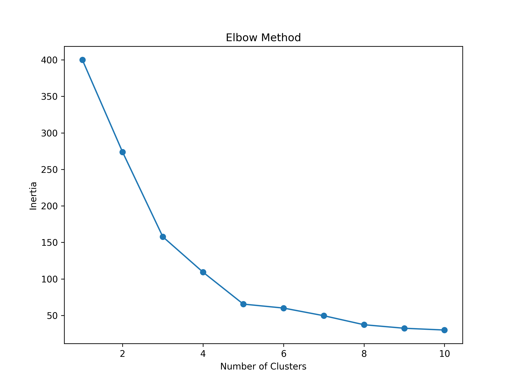
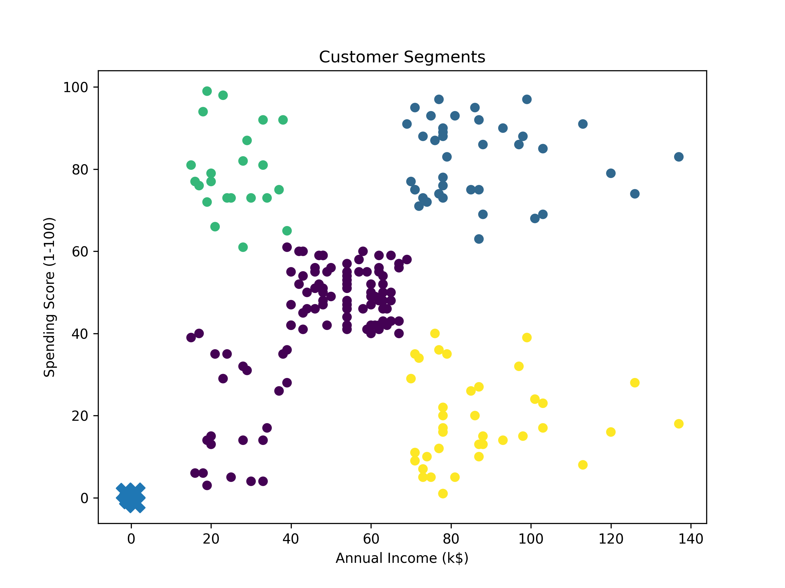
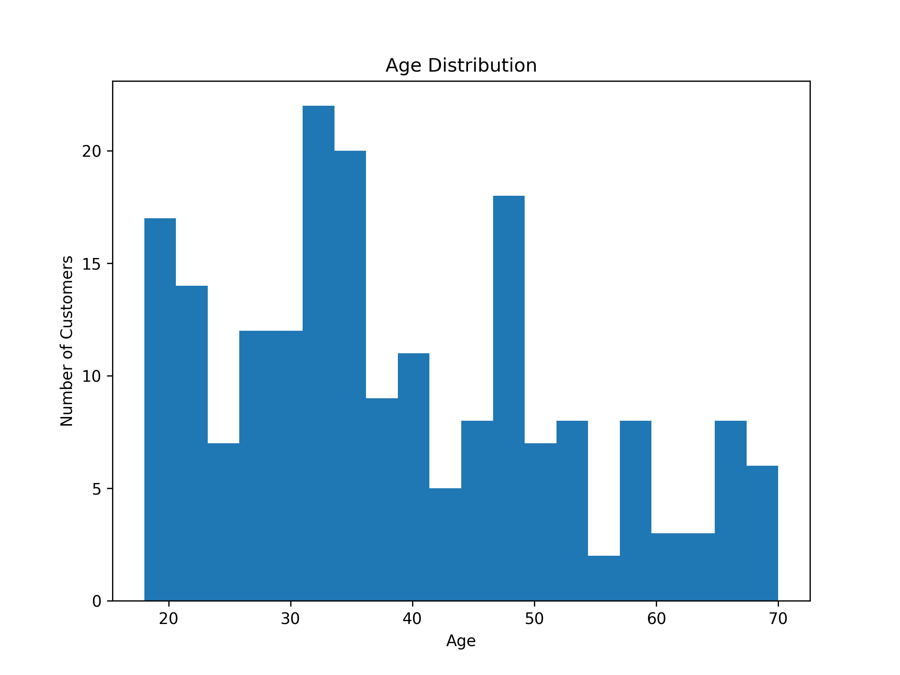

# Customer Segmentation and Spending Behavior Analysis

Data analysis project exploring customer demographics and spending patterns to identify meaningful customer segments and key drivers of purchasing behavior.

The project demonstrates a complete **data analyst workflow**, including data cleaning, exploratory data analysis (EDA), statistical exploration, clustering, and business insight generation.

## Executive Summary

- Identified distinct customer segments based on income and spending behavior.
- Found clear differences in customer value, engagement potential, and targeting strategy across segments.
- Used clustering as an analytical tool to support customer understanding, not as an end in itself.
- Translated segment profiles into practical business actions such as loyalty, retention, and targeted promotion strategies.
  
---
## Business Question

Which customer groups show the strongest spending potential, how do they differ in terms of income and behavior, and how can these segments support more targeted business and marketing decisions?

Key objectives:

- Identify factors influencing customer spending behavior
- Explore relationships between income, age, and spending
- Detect meaningful customer segments
- Generate insights that could support marketing decisions

---

# Dataset

Customer demographic and spending data.

Main variables:

| Variable | Description |
|--------|-------------|
| CustomerID | Unique customer identifier |
| Gender | Customer gender |
| Age | Customer age |
| Annual Income | Annual income (k$) |
| Spending Score | Spending index assigned by the store |

Dataset source:  
Public dataset for customer segmentation analysis.

---

## Analytical Framing

This project approaches customer segmentation as a business analytics task.
The goal is not only to detect clusters in the data, but also to interpret them in a way that supports decision-making, customer targeting, and prioritization.

---

# Analytical Workflow

## 1. Data Loading

- Imported dataset
- Inspected structure and column types
- Verified dataset integrity

---

## 2. Data Cleaning

- Checked for missing values
- Verified data types
- Inspected dataset structure
- Prepared variables for analysis

---

## 3. Exploratory Data Analysis (EDA)

Explored distributions and relationships between variables.

Key analyses included:

- Age distribution
- Income distribution
- Spending score distribution
- Correlation analysis
- Income vs spending patterns

Visualizations used:

- Histograms
- Scatter plots
- Box plots
- Correlation heatmap

---

## 4. Customer Segmentation

Clustering techniques were used to identify customer groups based on spending behavior and income.

Approach:

- Feature selection
- Feature scaling
- Applying K-Means clustering
- Interpreting resulting segments

Example segments:

| Segment | Description |
|-------|-------------|
| High income / high spending | High-value customers |
| High income / low spending | Potential marketing targets |
| Low income / high spending | Impulse buyers |
| Low income / low spending | Low-value segment |

---

## Cluster Profiling

| Cluster | Income Level | Spending Behavior | Interpretation |
|-------|-------------|-------------|-------------|
| 0 | High | High | High Value Customers |
| 1 | High | Low | Careful Spenders |
| 2 | Low | High | Potential Loyalists |
| 3 | Low | Low | Low Engagement |

---

## Visualizations

### Elbow Method

### Customer Segments

### Age Distribution

---

## Business Insights

Customer segments become more useful when they are interpreted as decision-support groups rather than only visual clusters.

In this project, each segment is analyzed in terms of:
- spending intensity
- relative income level
- likely customer value
- possible business relevance
- potential targeting strategy

The objective is to connect analytical output with practical actions such as retention, personalization, and differentiated marketing.

### Example Segment Interpretation

| Segment | Description | Business Strategy |
|-------|-------------|----------------|
| High Value Customers | High spending and frequent purchases | Loyalty programs, VIP offers |
| Potential Loyalists | Medium spending but growing activity | Targeted promotions, bundles |
| Occasional Buyers | Low frequency and moderate spending | Retargeting campaigns |
| At-Risk Customers | Previously active but declining | Win-back campaigns |

## Why This Matters

Customer segmentation is valuable when it helps move from descriptive analysis to better decisions.

This project shows how exploratory analysis and clustering can support:
- clearer customer understanding
- better prioritization of marketing actions
- more structured interpretation of customer value
- stronger alignment between data work and business questions

The focus is not only on building segments, but on explaining why they matter and how they could be used.

## Limitations

This analysis is based on a compact public dataset and should be interpreted within its scope.

Key limitations include:
- the dataset does not include transaction history
- there is no time dimension for retention or churn analysis
- the spending score is a predefined index from the dataset source, not raw purchase value
- customer behavior is inferred from limited features only

Because of this, the segmentation is best understood as an analytical exercise in customer profiling rather than a production-ready commercial model.

## Next Steps

To make this type of analysis more realistic in a business environment, the next iteration could include:

- transaction-level purchase history
- retention and repeat-purchase analysis
- recency, frequency, and monetary value features
- validation of segments against campaign response or revenue metrics
- comparison of segment performance over time

# Tools & Technologies

Python  
Pandas  
NumPy  
Matplotlib  
Seaborn  
Scikit-learn  
Jupyter Notebook  

---
# Project Structure

data/
  └── dataset.csv
notebooks/
  ├── eda.ipynb
│ └── customer_segmentation.ipynb
visualizations/
  └── plots/
README.md
---

# Key Skills Demonstrated

- Exploratory Data Analysis (EDA)
- Data cleaning and preprocessing
- Data visualization
- Customer segmentation
- Clustering techniques
- Analytical storytelling
- Translating data into business insights

---

## Key Takeaway

The main value of this project is not clustering by itself, but the ability to turn customer patterns into interpretable, business-relevant insights.

---

# Author

**Larysa Yanushchyk**

GitHub:  https://github.com/BuhaAutilla
